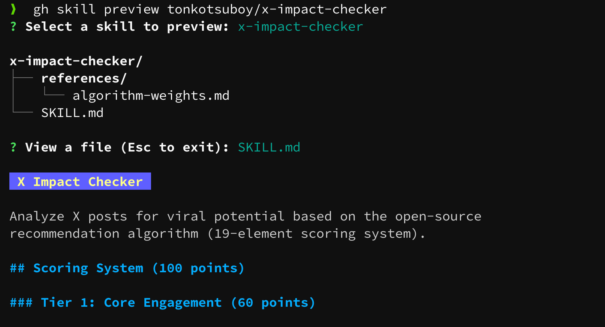

---

## title: "GitHub CLIからAgent Skillsをパッケージ管理できる「gh skill」が登場。npx skillsとの違いを添えて"

emoji: "🐙"
type: "tech"
topics: ["github", "githubcli", "claudecode", "ai", "agentskills"]
published: true
publication_name: ubie_dev

2026/04/16、GitHub公式CLIの`gh`に、スキル（Agent Skills）をパッケージ管理する新しいサブコマンド`gh skill`が追加されました。GitHubのリポジトリに公開されているスキルを、`gh`経由でインストール・アップデート・公開できます。筆者はこれまで`npx skills`でスキルをインストール・管理してきましたが、`gh skill`の方が安全面でよさそうなので乗り換えることにしました。

本記事では、`gh skill`の基本とメリットを実際の実行結果とともに解説します。

[https://github.blog/changelog/2026-04-16-manage-agent-skills-with-github-cli/](https://github.blog/changelog/2026-04-16-manage-agent-skills-with-github-cli/)

## 環境準備

GitHub CLI v2.90.0以上が必要です。筆者環境の実行例は次のとおりです。

```bash
$ gh --version
// gh version 2.90.0 (2026-04-16)
// https://github.com/cli/cli/releases/tag/v2.90.0
```

`$gh skill --help`でサブコマンドの一覧を確認すると、次のコマンドが使えることがわかります。

- `search`: GitHub上に公開されているスキルを検索する
- `preview`: インストール前に`SKILL.md`の中身を確認する
- `install`: スキルをローカルにインストールする
- `update`: インストール済みスキルを最新版に更新する
- `publish`: 自分のスキルをagentskills.io仕様でバリデーションしつつ、GitHubリリースとして公開する

## 実際に使ってみる

筆者は以前、X（旧Twitter）の投稿のバズり度を採点する[x-impact-checker](https://github.com/tonkotsuboy/x-impact-checker)というスキルを公開しました。スキルを`gh skill`で導入します。

### 1. `gh skill preview`で中身を先に確認

いきなりスキルをインストールする前に、`gh skill preview`で`SKILL.md`の中身を確認できます。怪しいスキルじゃないかの確認に便利です。

```bash
$ gh skill preview tonkotsuboy/x-impact-checker
```

確認ダイアログを進めると、スキルの中身が出力されます。この時点ではスキルはインストールされません。




`gh skill`が面倒を見てくれるのは、スキルのインストール経路やバージョン情報までです。スキル本体のプロンプトが安全かどうかは、自分の目で確認する必要があります。

プロンプトインジェクション（AIへの命令文を不正に混ぜ込み、意図しない挙動を引き起こす攻撃）は、インストール前に中身を読まないと防げません。`preview`はそのための機能です。

公式のchangelogでも、次のように注意されています。

> Skills are not verified by GitHub and may contain prompt injections, hidden instructions, or malicious scripts. We strongly recommend inspecting the content of skills before installation.
>
> — [Manage agent skills with GitHub CLI - GitHub Changelog](https://github.blog/changelog/2026-04-16-manage-agent-skills-with-github-cli/)

### 2. インストール

`gh skill install`で入れます。`--agent`や`--scope`を省略すると、対話プロンプトでどのエージェントに入れるか、ユーザー全体かプロジェクト単位かを聞かれます。

```bash
$ gh skill install tonkotsuboy/x-impact-checker x-impact-checker
Using ref v2.0.6 (2536b49f)
```

`Using ref v2.0.6`と出ているのが大事なところです。バージョン指定を省略したときは、最新のタグが優先的に選ばれる仕様です。タグが無ければデフォルトブランチのHEADにフォールバックします。黙って`main`の最新を持ってくるわけではない、という作りになっています。

### 3. 配置先の確認

Claude Code向けにユーザー全体でインストールした場合、`~/.claude/skills/`直下に入ります。

```bash
$ ls ~/.claude/skills/x-impact-checker/
SKILL.md  references
```

シンボリックリンクではなく、実体ファイルとして入っています。

# 地味に一番嬉しかった点：配置先が`~/.claude/skills/`直下

`npx skills`の仕様では、スキルの実体は`~/.agents/skills/`に置かれます。一方でClaude Codeは`~/.claude/skills/`しか見ないので、筆者は`~/.agents/skills/`から`~/.claude/skills/`へシンボリックリンクを張る構成で運用していました。

agentskills.ioの仕様は、スキルをローカルのどこに置くかまでは規定していません。`npx skills`は自前ディレクトリ`~/.agents/skills/`を正とする設計、`gh skill`は各エージェントの純正ディレクトリ（Claude Codeなら`~/.claude/skills/`）に直接置く設計です。どちらも仕様違反ではなく別の実装方針ですが、Claude Codeだけを使う筆者にとっては`gh skill`のほうが体感のハマりは少ないです。

`gh skill --agent claude-code`で入れた瞬間に`~/.claude/skills/`直下に実体が置かれるので、リンクを意識する必要がなくなりました。

# バージョン固定とサプライチェーン完全性

`gh skill`の面白いところは、インストールしたスキルが勝手に書き換わらない仕組みを複数層で積み上げている点です。

## 4つの仕組み

公式changelogでは、以下の4つが挙げられています。

- Immutable Release: 公開後のリリース内容をリポジトリの管理者でも書き換えられなくする設定
- Tree SHA による検知: スキルフォルダ全体のハッシュ値を`SKILL.md`に記録し、リモートの中身が変わると検出できる
- Version Pinning: `--pin`で特定のタグ・コミットに固定する。`update`でも自動更新されない
- Portable Provenance: 出自情報（リポジトリ、ref、tree SHA）を`SKILL.md`自体に埋め込むので、ファイルを別環境にコピーしても出自がついて回る

公式のchangelogでは、provenanceが`SKILL.md`に書き込まれるタイミングについて、次のように書かれています。

> When `gh skill` installs a skill, it writes tracking metadata (repository, ref, tree SHA) directly into the `SKILL.md` frontmatter.

provenanceはインストール時に書き込まれる情報です。後ほど`gh skill publish`の章で、この非対称な作りの意味が見えてきます。

## 実際にfrontmatterを見てみる

`gh skill install`で入れた`x-impact-checker`の`SKILL.md`の先頭を見てみます。

```bash
$ head -10 ~/.claude/skills/x-impact-checker/SKILL.md
---

description: 'Analyze X (Twitter) posts for viral potential using the actual recommendation algorithm. ...'
metadata:
github-path: skills/x-impact-checker
github-ref: refs/tags/v2.0.6
github-repo: https://github.com/tonkotsuboy/x-impact-checker
github-tree-sha: f7a74cc1c1d6fc8650d00a7ad441d330e8f11e62
name: x-impact-checker

---

````

`metadata:`ブロックの4行がPortable Provenanceの実体です。

- `github-path`はリポジトリ内でのスキルの位置
- `github-ref`はどのタグ・ブランチ由来か（`refs/tags/v2.0.6`ならv2.0.6タグ固定）
- `github-repo`は出身リポジトリのURL
- `github-tree-sha`はフォルダ全体のハッシュ値（改ざん検知用）

この情報が`SKILL.md`自体に埋まっているので、ファイルを別のマシンにコピーしても出自がついて回ります。`gh skill update`はここを読んで、リモートで中身が更新されているかを判定します。

## `gh skill update`でアップデート状況を見る

`--dry-run`を付けると、実際の書き換えは行わず、どのスキルに更新があるかだけを報告してくれます。実行結果は次のとおりです（抜粋）。

```bash
$ gh skill update --dry-run
! ai-deodorizer has no GitHub metadata. Reinstall to enable updates
! calendar has no GitHub metadata. Reinstall to enable updates
! commit-message-rules has no GitHub metadata. Reinstall to enable updates
...
All skills are up to date.
````

GitHubメタデータが入っていないスキル（`npx skills`や手動配置で入れたもの）は「Reinstall to enable updates」と案内が出ます。出自情報が無いとアップデートのしようがない、という作りです。

筆者はUbieという医療系スタートアップで働いているので、AIへの命令書が勝手に書き換わらない作りが最初から入っているのは、業務で使う立場として助かります。

# 配布する側として：`gh skill publish`

`gh skill`はスキルを入れる側だけでなく、配る側まで公式CLIで面倒を見てくれます。

`gh skill publish --help`の先頭は次のとおりです。

```
Validate a local repository's skills against the Agent Skills specification
and publish them by creating a GitHub release.
```

ローカルの`SKILL.md`群が[agentskills.io](https://agentskills.io/)の仕様を満たしているかをバリデーションし、通ったら対話形式でGitHubリリースを作成します。

## agentskills.io仕様への準拠チェック

agentskills.ioは、スキルの`SKILL.md`が備えるべき命名規則やフロントマターの項目を定めた共通仕様です。Claude Code、Cursor、Codex、GitHub Copilot、Gemini CLI、Antigravityといったエージェントが、同じ仕様のスキルを読めるようになっています。

バリデーションの中身はヘルプに明記されています。

> Validation checks include:
>
> - Skill names match the strict agentskills.io naming rules
> - Each skill name matches its directory name
> - Required frontmatter fields (name, description) are present
> - allowed-tools is a string, not an array
> - Install metadata (`metadata.github-*`) is stripped if present

スキル名がagentskills.ioの命名規則に合っているか、ディレクトリ名と一致しているか、`name`と`description`が書かれているか、といった基本項目を`gh skill publish`が機械的にチェックしてくれます。

## リポジトリ側のセキュリティ設定もチェックする

公式のchangelogには、publishがスキル本体の検証だけでなく、リポジトリ側のリモート設定もチェックすると書かれています。

> If you maintain a skills repository, `gh skill publish` validates your skills against the agentskills.io spec and checks remote settings like tag protection, secret scanning, and code scanning. These settings are not required, but strongly recommended to improve the supply chain security of your repo.

対象は次の3つです。

■ それぞれの意味

- tag protection: タグを後から別コミットに付け替えられるのを防ぐリポジトリ設定
- secret scanning: コミットに秘密情報（APIキー等）が紛れ込んでいないかのスキャン
- code scanning: コードの脆弱性スキャン

immutable releases（リリース内容を不変にする設定）についても、changelogで次のように書かれています。

> Enabling immutable releases, for example, means even if someone gets control of your repository they cannot change existing releases, so users installing via tag pinning are fully protected. The publish command makes it trivial to enable these features.

リポジトリの権限を乗っ取られても、過去のリリースは書き換えられない。だから`--pin`でタグ固定したユーザーは守られる、ということです。`--pin v1.0.0`で固定したつもりでも、配布元でタグがforce pushで別コミットに付け替えられたら意味がありません。配布側のGitHub設定まで固めて、ようやく`--pin`が機能します。

## `--fix`の挙動を実際に試してみる

changelogには`publish`が何を検証するかは書かれていますが、`--fix`が具体的にSKILL.mdをどう書き換えるかまでは書かれていません。そこで実際に検証しました。自作の`x-impact-checker`をGitHubからクローンし、2つの状態で`gh skill publish --fix`を実行して、`git diff`で結果を見ます。

### ケースA: クリーンな状態（metadataなし）

クローン直後の`SKILL.md`は配布用のクリーンな状態で、`metadata:`ブロックは入っていません。この状態で`--fix`を実行します。

```bash
$ cd x-impact-checker
$ gh skill publish --fix
warning x-impact-checker recommended field missing: license

Validation passed. Use --tag to publish non-interactively.

$ git diff skills/x-impact-checker/SKILL.md
（差分なし）
```

`license`フィールドが推奨なのに欠けている、というwarningは出ますが、`--fix`はこれを勝手には埋めません。書き換えが必要な箇所が無かったので、`SKILL.md`は変化しません。

### ケースB: install metadataが入った状態

次に、`~/.claude/skills/x-impact-checker/SKILL.md`（`gh skill install`で入れた、provenance付きの状態）を配布元にコピーしてから実行します。配布元のソースにうっかりinstall metadataが混入したケースを再現します。

`--dry-run`で検証だけしたときのログが次のとおりです。

```bash
$ gh skill publish --dry-run
error x-impact-checker contains install metadata that must be stripped: github-path, github-ref, github-repo, github-tree-sha (use --fix)
warning x-impact-checker recommended field missing: license
validation failed with 1 error(s)
```

install metadataが入っているので削除すべき、というエラーです。`(use --fix)`の案内どおり、`--fix`を付けて再実行します。

```bash
$ gh skill publish --fix
fixed x-impact-checker stripped install metadata: github-path, github-ref, github-repo, github-tree-sha
warning x-impact-checker recommended field missing: license

Validation passed. Use --tag to publish non-interactively.
```

`fixed ... stripped install metadata: github-path, github-ref, github-repo, github-tree-sha`と出ました。install metadataを削除した、というログです。

▼ `git diff`で実際に書き換えられた内容

```diff
diff --git a/skills/x-impact-checker/SKILL.md b/skills/x-impact-checker/SKILL.md
--- a/skills/x-impact-checker/SKILL.md
+++ b/skills/x-impact-checker/SKILL.md
@@ -1,14 +1,7 @@
 ---
+description: 'Analyze X (Twitter) posts for viral potential using the actual recommendation algorithm. Use when user wants to: (1) ...'
 name: x-impact-checker
-description: >
-  Analyze X (Twitter) posts for viral potential using the actual recommendation algorithm.
-  Use when user wants to: (1) Check if a post will go viral, (2) Optimize a tweet for engagement,
-  (3) Improve post performance. Triggers: "Check if this will go viral", "Make this post buzz",
-  "Will this tweet perform well?", "Optimize my tweet", "How can I make this viral?",
-  "バズるかチェックして", "Xでバズる投稿にして", "伸びるかチェックして", "この投稿を伸ばして",
-  "投稿を改善して", "ツイートを最適化して"
 ---
-
 # X Impact Checker
```

■ `--fix`が行った変更

- install metadata 4行を削除（diffでは抜粋のため直接表示されないが、`@@ -1,14 +1,7 @@`から14行→7行に減っている）
- `description: >`の折りたたみ記法を、単一引用符でくるんだインライン文字列に変換
- `description`と`name`の順序をアルファベット順に並べ替え
- ファイル末尾の余分な空行を削除

`--fix`の本務は、配布元からinstall metadataを削除すること。ついでにYAMLの整形もやってくれます。

## provenanceの流れ

- install時: `gh skill install`が`metadata.github-*`を`SKILL.md`に書き込む
- publish時: `gh skill publish --fix`が、間違って配布元に混入した`metadata.github-*`を削除する
- 結果、provenanceは利用者の手元でだけ存在する

provenanceは「このスキルがどのリリースから来たか」をインストール側で示す情報なので、配布元のソースに最初から書かれていると意味が逆になります。`--fix`はそのねじれを直してくれます。

自作スキルをGitHubに置きっぱなしにしていると、名前が大文字混じりでagentskills.io仕様違反だったり、`description`が短すぎたり、壊れていることがあります。`publish --fix`をCIに入れておけば、配布時点でその手の事故を潰せます。中身の修正が必要なケースは手動対応ですが、そこは`--dry-run`がエラーで教えてくれます。

# `npx skills`との違い

筆者はこれまで、スキルのインストールや更新にVercel Labsのskillsコマンドを使っていました。

[https://github.com/vercel-labs/skills](https://github.com/vercel-labs/skills)

比較は次のとおりです。

| 項目                            | `gh skill`                                                                     | `npx skills`        |
| ------------------------------- | ------------------------------------------------------------------------------ | ------------------- |
| 開発元                          | GitHub公式                                                                     | Vercel Labs         |
| 対応エージェント                | 6種 (Claude Code / Cursor / Codex / GitHub Copilot / Gemini CLI / Antigravity) | より広範            |
| バージョン固定                  | `--pin`で明示的に固定                                                          | 仕様による          |
| tree SHAによる改ざん検知        | あり                                                                           | なし                |
| 出自情報をfrontmatterに埋め込み | あり                                                                           | なし                |
| immutable releasesとの連携      | あり                                                                           | なし                |
| Claude Codeでの配置先           | `~/.claude/skills/`直下                                                        | `~/.agents/skills/` |

対応エージェントの幅は`npx skills`のほうが広く、複数エージェントを横断的に使うなら`npx skills`が便利です。Claude Codeメインの筆者や、業務でサプライチェイン（部品・依存関係の供給網）のセキュリティを気にしたい場面では`gh skill`が向いています。

> サプライチェイン攻撃とは、ソフトウェアが依存している外部の部品（ライブラリやスキル等）に細工を仕込んで、利用者側のシステムを間接的に狙う攻撃のことです。

筆者はClaude Codeメインで、自作スキルもGitHubに公開する運用なので、当面は`gh skill`中心に寄せ、どうしても対応が必要なエージェントがあるときだけ`npx skills`を混ぜる、という併用をしています。

# さいごに

`gh skill`はスキルを使う側と配る側の両方を、公式CLIで面倒みるようにできています。Claude Codeメインで使う人には、配置先がそのまま`~/.claude/skills/`に入る点だけでも試す価値があります。業務でスキルを本番運用するチームには、バージョン固定・tree SHA検知・portable provenanceといったサプライチェーン対策がありがたい場面が来そうです。

標準化はまだ過渡期で、スキルの仕様は配置先を規定していないので、どちらを選ぶかは好みで決まります。公式CLIが`publish`まで揃えてきたのは、スキルを配る側のハードルを下げるという意味で地味に大きいと思います。

2026/04/16時点ではpublic previewであり、仕様は予告なく変わる可能性があります。最新情報は公式のchangelogとagentskills.ioを確認してください。

- [Manage agent skills with GitHub CLI - GitHub Changelog](https://github.blog/changelog/2026-04-16-manage-agent-skills-with-github-cli/)
- [agentskills.io](https://agentskills.io/)

---

Ubieでは、こうしたAIツールのエコシステムに乗り遅れずに使い倒しながら、医療体験の改善に取り組んでいます。ご興味のある方はぜひ。

[https://recruit.ubie.life/](https://recruit.ubie.life/)
